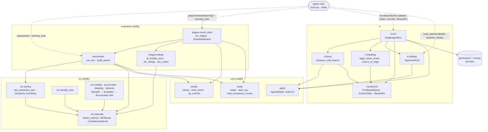

# gamekit

Game-agnostic agents, Monte Carlo statistics, and a benchmark harness for
game-simulation/ML projects.

Extracted from [catan](https://github.com/guidodinello/catan)'s
`agents/base.py`, `experiments/mcstats.py`, and the game-agnostic parts of
`experiments/benchmark.py`, with `truco-py` as the second reference
implementation and mmo-utils' `DESIGN.md` folded in as requirements for the
`mc` module. See `~/projects/docs/shared-ml-package.md` for the full design
history.

## Modules

- `gamekit.agent` — the `Agent[StateT, ActionT]` protocol.
- `gamekit.mc` — confidence intervals (including `wilson_interval`),
  sample-size formulas, two-proportion testing with Benjamini–Hochberg
  multiple-comparison correction, and streaming accumulators (stdlib-only),
  plus one unified Monte Carlo sampling model: `monte_carlo`/`monte_carlo_reduce` (a
  `Sampler -> Evaluator -> Accumulator` fold, admitting both scalar and
  vectorized samplers with no numpy dependency), variance reduction
  (`antithetic`, `control_variate`), and adaptive stopping
  (`monte_carlo_until`, run until a target confidence-interval half-width).
- `gamekit.seats` — seat-keyed RNG streams (`seat_rng`, plus the deprecated
  pre-0.2.0 `seat_rng_legacy` for replaying old results), lineup rotation,
  and seat-occupancy counting.
- `gamekit.results` — git-commit-stamped JSON result files.
- `gamekit.benchmark` — a field-free benchmark-arm runner: mandatory seat
  rotation, win-rate summaries by role and by seat, a two-proportion
  comparison, and a CLI skeleton. Never names a game's own record type.
- `gamekit.league` — a seat-rotated round-robin over named agents, resumable
  per pairing, with an anchored Bradley-Terry/Elo fit (stdlib-only), bootstrap
  CIs, the pairwise win matrix, and a cycle report. See research note 022.
- `gamekit.rl` (`[rl]` extra) — the reusable structure of a single-agent RL
  training loop, extracted from `truco-py`'s `training/env.py`:
  `gamekit.rl.protocols` (`TurnBasedGame`, `ActionCodec`, `RewardFn` —
  stdlib), `gamekit.rl.driver` (`advance_until_learner`, auto-stepping every
  non-learner seat until the learner must act — stdlib),
  `gamekit.rl.selfplay` (`OpponentPool`, checkpoint resampling with a
  baseline-mix fallback, run-scoped via `run_id` — stdlib),
  `gamekit.rl.masking` (legal-action mask building and coercing an illegal
  index to a legal one — stdlib), and
  `gamekit.rl.env` (`SingleAgentEnv`, a `gym.Env`
  subclass — needs `gymnasium`/`numpy`, the only submodule that does).
  `gamekit.rl` never imports a training framework (no torch, no
  stable-baselines3/sb3-contrib) — checkpoint loading is injected by the
  caller as a plain callable.

  **What a variable/spatial-action-space game (e.g. `catan`'s planned Phase
  5) would supply, not build**: `SingleAgentEnv` serves the flat,
  masked-`Discrete` case only. A game whose legal-action set can't be
  enumerated into a fixed-width mask reuses `protocols`/`driver`/`selfplay`
  directly and writes its own `gym.Env` around them — the module split
  exists specifically so that reuse doesn't require a flat action space.
  Either way, a game supplies: a thin `TurnBasedGame` adapter over its own
  engine (no engine change); its own `observation_space`/`action_space`
  objects; an encoder; a reward callable; and, for self-play, a
  checkpoint-loading callable.

## Architecture

Solid arrows come from the `import` statements in `src/gamekit`: A → B means A
uses symbols defined in B. (`benchmark` and `league.ratings` import them through
the `gamekit.mc` package.) Dotted arrows show what a game supplies. Every module
except `rl.env` is stdlib-only. `benchmark` and `league` never import `Agent`:
they work with agent *names* and a game-supplied `play` callable.



The `mc.sample · accumulate · stopping · variance` node is collapsed for
readability. Inside it, `sample` imports `accumulate`; `stopping` and `variance`
import `sample`; and `stopping`, `sample` and `accumulate` each import
`mc.intervals` directly.

The package-level edges are enforced in CI by [`tach.toml`](tach.toml): an
import that is not drawn here fails the `Module Boundaries (Python)` job.

A detailed version (module index, what a game implements, data flows) is in
[`docs/architecture.html`](docs/architecture.html), the canonical copy. Open it
in a browser from a clone, since GitHub shows HTML as source. A rendered copy is
also at <https://claude.ai/artifact/Gz3HUTZNnrnqZXwZGUwT7E>; it is private
unless shared and may lag the in-repo file.

## Scope

Core is stdlib + nothing else — no runtime dependencies, including
`gamekit.mc`'s sampling model: a vectorized sampler returning a numpy
`ndarray` satisfies `Sampler[T]` structurally (`Callable[[int],
Iterable[T]]`), so numpy is never imported by gamekit itself. `gamekit.rl`'s
`[rl]` extra (gymnasium + numpy) is the only place a
runtime dependency arrives, and only for callers who install that extra.

## Installation

As a git dependency (the same pattern used by
[`guidodinello/logger`](https://github.com/guidodinello/logger)):

```toml
[project]
dependencies = ["gamekit"]

[tool.uv.sources]
gamekit = { git = "https://github.com/guidodinello/gamekit", branch = "main" }
```

For `gamekit.rl.env`, depend on the `[rl]` extra instead:
`dependencies = ["gamekit[rl]"]`.

## Development

```sh
uv sync --dev                 # add `--extra rl` to exercise gamekit.rl.env
uv run ruff format --check .
uv run ruff check .
uv run mypy src tests
uv run pytest
```

## Research

Hypotheses, technique notes, and paper citations live in
[`docs/research/`](docs/research/README.md); per-game experiment logs live
in the consumer repos.

## Roadmap

Planned work is indexed in the pinned
[Roadmap issue](https://github.com/guidodinello/gamekit/issues/59), which
orders open issues as Now / Next / Later and groups them by theme.
